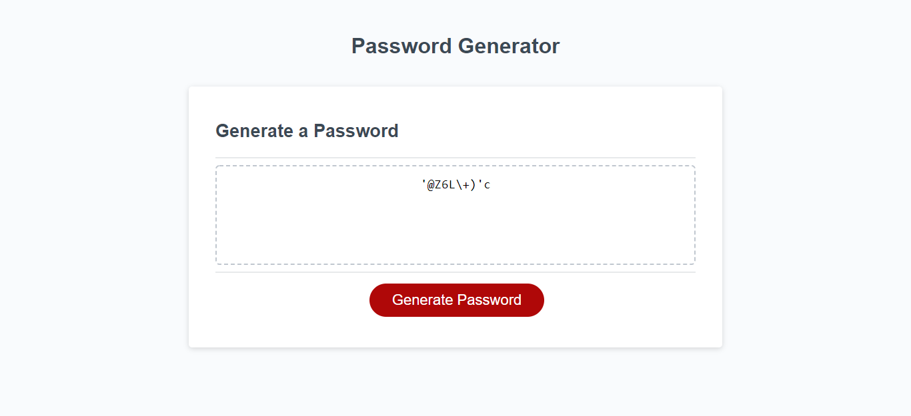

# JavaScript Challenge

## Purpose
This website is a random password generator. It allows users to pick different elements such as: uppercase letters, lowercase letters, special characters and numbers. It also gives them the option to pick the length of their password, which must be between 8 to 128 characters long. 

## Built With 
* HTML 
* CSS
* JavaScript 

## Website 
https://carolinacez.github.io/java-challenge/

## Page Layout

## Contribution
Collaborated on this challenge with: Allie Watkins, Joseph Klein, Alex Costan (TA), Josh Hall, and Shaun Mardones.
